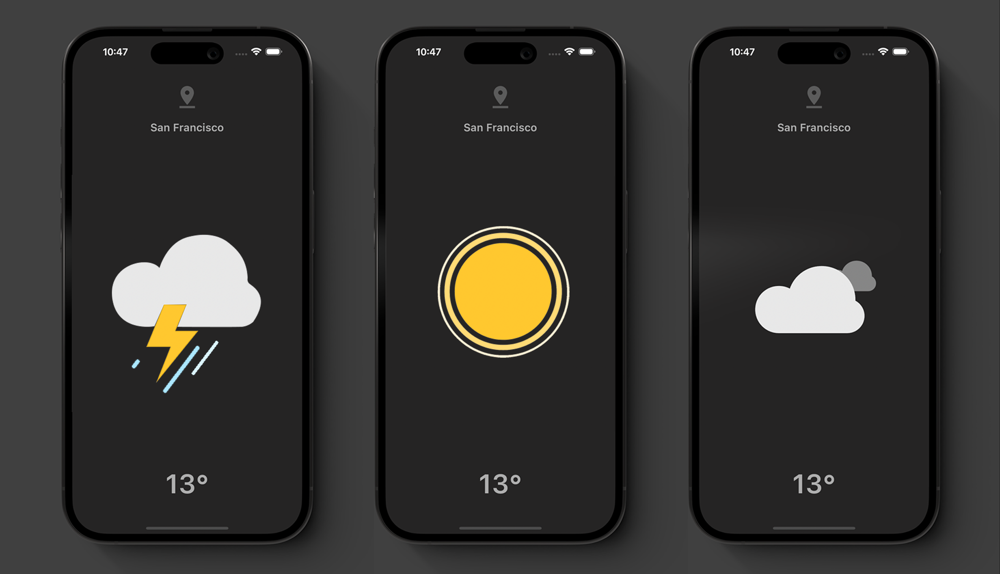

# Minimal Weather App • Flutter API Tutorial

This is a WeatherApp made with the purpose of studying new packages and functionalities. Understanding fetching API using HTTP package and providing information from the Weather API.

# Features

- Lottie Files animation [https://lottiefiles.com/]
- Geolocation
- HTTP fetching API
- Weather API [https://openweathermap.org/]

### Credits to The YouTube Channel Mitch Koko.
